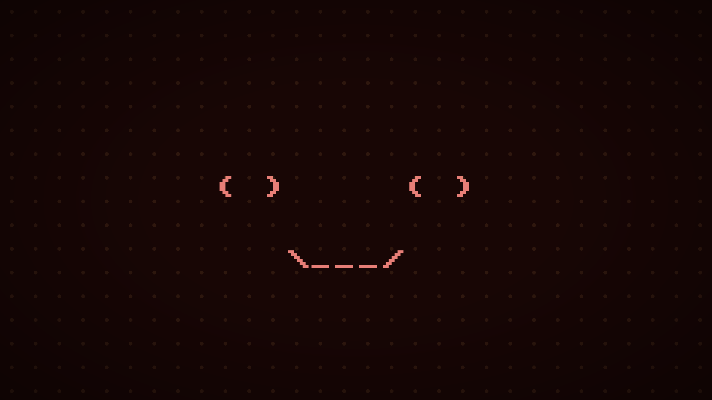
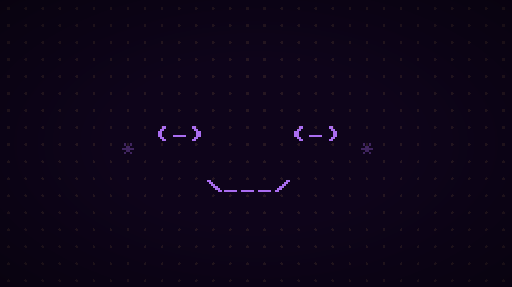
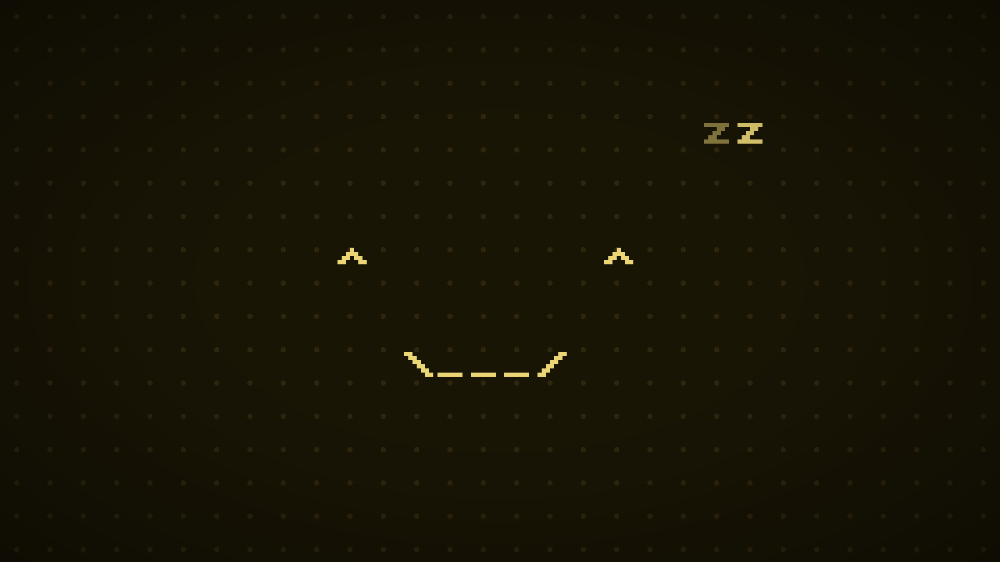

# Buddy

Buddy is a little guy you can keep running while you work to keep you company. Looks great on one of those retro monitors.

https://dfosco.github.io/buddy

Falls asleep often, click to wake.

||||
|---|---|---|
||||


---

### Development

```bash

# Run 
npm run dev

# Build
npm run build 

# Run dedicated window on Chrome Canary
sh launch-kiosk.sh
```

---

MIT License